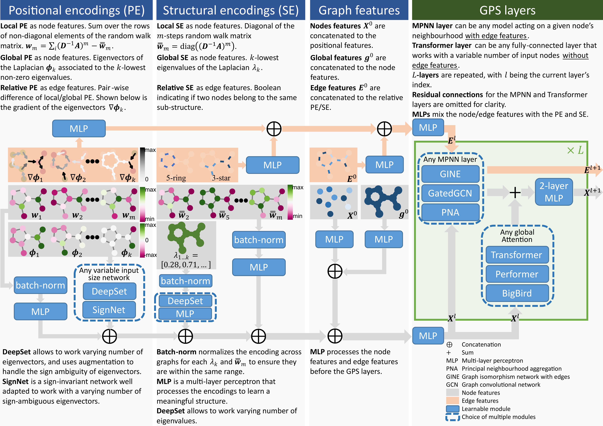

# GraphGPS: General Powerful Scalable Graph Transformers

[](https://arxiv.org/abs/2205.12454)
[](https://paperswithcode.com/sota/graph-regression-on-zinc?p=recipe-for-a-general-powerful-scalable-graph)




How to build a graph Transformer? We provide a 3-part recipe on how to build graph Transformers with linear complexity. Our GPS recipe consists of choosing 3 main ingredients:
1. positional/structural encoding: [LapPE](https://arxiv.org/abs/2106.03893), [RWSE](https://arxiv.org/abs/2110.07875), [SignNet](https://arxiv.org/abs/2202.13013), [EquivStableLapPE](https://arxiv.org/abs/2203.00199)
2. local message-passing mechanism: [GatedGCN](https://arxiv.org/abs/1711.07553), [GINE](https://arxiv.org/abs/1905.12265), [PNA](https://arxiv.org/abs/2004.05718)
3. global attention mechanism: [Transformer](https://arxiv.org/abs/1706.03762), [Performer](https://arxiv.org/abs/2009.14794), [BigBird](https://arxiv.org/abs/2007.14062)

In this *GraphGPS* package we provide several positional/structural encodings and model choices, implementing the GPS recipe. GraphGPS is built using [PyG](https://www.pyg.org/) and [GraphGym from PyG2](https://pytorch-geometric.readthedocs.io/en/2.0.0/notes/graphgym.html).
Specifically *PyG v2.2* is required.


### Python environment setup with Conda

```bash
conda create -n graphgps python=3.10
conda activate graphgps

conda install pytorch=1.13 torchvision torchaudio pytorch-cuda=11.7 -c pytorch -c nvidia
conda install pyg=2.2 -c pyg -c conda-forge
pip install pyg-lib -f https://data.pyg.org/whl/torch-1.13.0+cu117.html

# RDKit is required for OGB-LSC PCQM4Mv2 and datasets derived from it.  
conda install openbabel fsspec rdkit -c conda-forge

pip install pytorch-lightning yacs torchmetrics
pip install performer-pytorch
pip install tensorboardX
pip install ogb
pip install wandb

conda clean --all
```


### Running GraphGPS
ESC-GNN has been implemented with GraphGPS

```bash
conda activate graphgps

# Running GPS with for ZINC.
python main.py --cfg configs/GPS/zinc-GPS.yaml  wandb.use False

# Running GPS with for ZINC-full.
python main.py --cfg configs/GPS/zinc-GPS-full.yaml  wandb.use False
```


## Citation

If you find this work useful, please cite our NeurIPS 2022 paper:
```bibtex
@article{rampasek2022GPS,
  title={{Recipe for a General, Powerful, Scalable Graph Transformer}}, 
  author={Ladislav Ramp\'{a}\v{s}ek and Mikhail Galkin and Vijay Prakash Dwivedi and Anh Tuan Luu and Guy Wolf and Dominique Beaini},
  journal={Advances in Neural Information Processing Systems},
  volume={35},
  year={2022}
}
```
